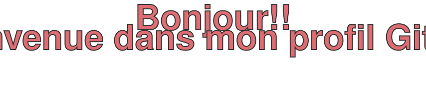

  

# 💫 À propos de moi :

👩🏾‍💻 Développeuse junior polyvalente | Web • Mobile • BDD • Réseaux

🎓 Parcours :
- BTS Systèmes Numériques
- Bachelor Développement
- L3 MIASHS Informatique

🛠️ Ce que je maîtrise :
- Front : React, JavaScript, TypeScript, HTML/CSS, Bootstrap, TailwindCSS
- Back : Python, PHP
- Biblio : Tkinter, PyQt
- Mobile : React Native (Expo)
- BDD : SQL, MySQL, SQLite; notions NoSQL: MongoDB
- Sys & Réseaux : Linux (Ubuntu), commandes Shell, Adressage IP, Routage

🌱 Toujours en train d'apprendre, de coder et de construire
   des projets qui ont du sens.

🎯 En recherche d'un stage ou d'une alternance
   dans le numérique (L3 en cours).

✨ Disciplinée • Autonome • Rigoureuse • Autodidacte

### 🌐 Contacts Sociaux:

)

---

# 💻 Socle Technique (langages, frameworks, librairies, bases de données, bibliothèques, outils, environnements, logiciels)

## 🗣️ Langages de programmation :

## 🎨 Frameworks et bibliothèques :

### Frontend :

### Backend :

## 📱 Applications Mobile :

## 🖥️ Applications Desktop :

## 🗄️ Bases de données :

### Outils de gestion de bases de données :

## 🛠️ Outils de développement et collaboration :

## 💡 Environnements de développement (IDE) :

## 🎨 Design et graphisme :

## 📋 Gestion de projet :

### Outils :

### Méthodologies :

## 🔧 Matériel — Systèmes embarqués :

## 🐧 Systèmes d'exploitation :

### Distributions Linux :

## 🌐 Réseau et infrastructure :

### Serveurs :

### Outils réseau :

## 🎮 Jeux et réalité virtuelle :

## 🤖 Agents IA & Outils d'intelligence artificielle :

## 🎤 Présentation et communication :

## 🏅 Certifications :

### ✍️ Random Dev Citations :

⭐️ _Merci pour votre visite !_
